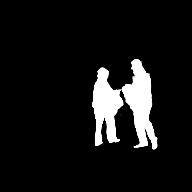
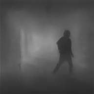

# Image Segmentation and Depth Estimation

Vision is one of the most important senses humans possess. The ability to capture light and make meaning out of it is a very convoluted task. For computers, these images are nothing but matrices and understanding the nuances behind these matrices has been a challenging task for researchers for many years until the rise of Deep Learning in Computer Vision. Many problems which were previously considered untouchable are now showing astounding results.

Two such problems are Image Segmentation and Depth Estimation. In Image Segmentation, the machine has to partition the image into different segments, each of them representing a different entity. In the example below you can see how my model separated the image on the left into segments (image on the right).

  
  

In Depth Estimation, the machine has to extract the depth information of the foreground entities from a single image. In the example below you can see how our well my model can extract the depth information (on the right) from an image (on the left).

  
  

In this project, I will describe my approach and present a Fully-Convolutional Neural Network Model which takes in a background and a background-foreground image and outputs the segmentation and depth mapping of the foreground object. The rest of the contents in the document are structrued as follows

- [Model Architecture](docs/architecture.md)
- [Dataset](docs/dataset.md)
- [Deciding Loss Function](docs/deciding_loss_function.md)
  - [Mask Prediction](docs/deciding_loss_function.md#mask-prediction)
  - [Depth and Segmentation Prediction](docs/deciding_loss_function.md#depth-and-segmentation-prediction)
- [Training](docs/training.md)
  - [RMSE + (BCE & Dice)](docs/training.md#rmse--bce--dice)
  - [SSIM + Dice](docs/training.md#ssim--dice)
  - [LR Range Test](docs/training.md#lr-range-test)
  - [RMSE + (BCE & Dice) with New LR and No Augmentation](docs/training.md#rmse--bce--dice-with-new-lr-and-no-augmentation)
- [Project Setup](docs/project_setup.md)
