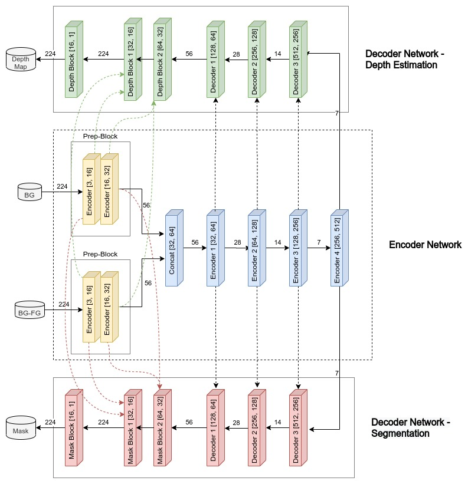

# Image Segmentation and Depth Estimation

Vision is one of the most important senses humans possess. The ability to capture light and make meaning out of it is a very convoluted task. For computers, these images are nothing but matrices and understanding the nuances behind these matrices has been a challenging task for researchers for many years until the rise of Deep Learning in Computer Vision. Many problems which were previously considered untouchable are now showing astounding results.

Two such problems are Image Segmentation and Depth Estimation. In Image Segmentation, the machine has to partition the image into different segments, each of them representing a different entity. In the example below you can see how my model separated the image on the left into segments (image on the right).

In Depth Estimation, the machine has to extract the depth information of the foreground entities from a single image. In the example below you can see how our well my model can extract the depth information (on the right) from an image (on the left).

In this project, I will describe my approach and present a Fully-Convolutional Neural Network Model which takes in a background and a background-foreground image and outputs the segmentation and depth mapping of the foreground object. The rest of the contents in the document are structrued as follows

- [Model Architecture](#model-architecture)
- [Dataset](#dataset)
- [Deciding Loss Function](docs/deciding_loss_functions.md)
  - [Mask Prediction](docs/deciding_loss_functions.md#mask-prediction)
  - [Depth and Segmentation Prediction](docs/deciding_loss_functions.md#depth-and-segmentation-prediction)
- [Training Model](#)

## Model Architecture

The model consists of an encoder-decoder architecture, where the model takes two inputs: BG and BG-FG and returns two outputs: Depth Map and Mask. The inputs are first individually processed through two encoder blocks each, which in turn reduces their size to 56x56, given the input shapes are 224x224. The reason for processing the two inputs separately for two encoder blocks is that:

- The output of these encoder blocks will be later fed as a skip connection to the last layers of the model, this might help the model in making better predictions as this way, the model will have the chance to see the two inputs separately in its last layers which may enhance its performance to identify the differences between the two inputs which is required to predict the mask and depth of the foreground object.
- An image of size 56x56 is sufficient for a convolutional model to extract information out of it. Thus we can apply two encoder blocks on the images separately before sending them to the network and not worry about losing information.

After encoding the inputs, they are merged together and sent through a series of encoder blocks until the image size becomes 7x7x512 (again a reminder, all these calculations are based on the fact that the input given to the model is 224x224).

After the encoding has been done, the encoded input is passed through two separate decoder networks which are responsible for predicting the depth map and the mask respectively. This encoder-decoder architecture is based on the famous convolutional neural network _UNet_.
The model architecutre can be seen below

Each of the encoder and decoder blocks are based on a ResNet block. The detailed diagram explaining the flow of each block can be seen below

The code for the full architecture can be found [here](tensornet/model/dsresnet.py)

## Dataset

The dataset used for this model was taken from [here](https://www.kaggle.com/shanwizard/modest-museum-dataset). The dataset contains 400,000 images of backgrounds, background-foregrounds and their corresponding masks and depth maps each. For more info on the dataset, please go to this [link](https://github.com/shan18/MODEST-Museum-Dataset).

### Preprocessing

- The input images (background and background-foreground) were normalized according to the values given on the dataset page.
- No preprocessing was done on the output images except converting them into torch.Tensor type and keeping their values within the range [0, 1].
- There was no point in applying any physical data augmentation techniques on the images as it would distort them from their corresponding labels which were not augmented.
- So, the only option left was to use photometric augmentations. I tried `HueSaturationValue` and `RandomContrast` augmentations from the `albumentations` package. The code for augmentation can be seen [here](tensornet/data/processing.py).

### Data Loading

- The dataset is huge, so it is not possible to load the entire dataset into memory at once. So only the images names are indexed and they are fetched on need basis. The code for data loading can be found [here](tensornet/data/datasets/modest_museum.py)
