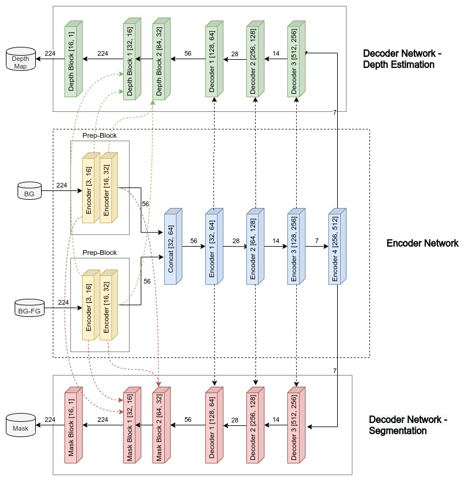
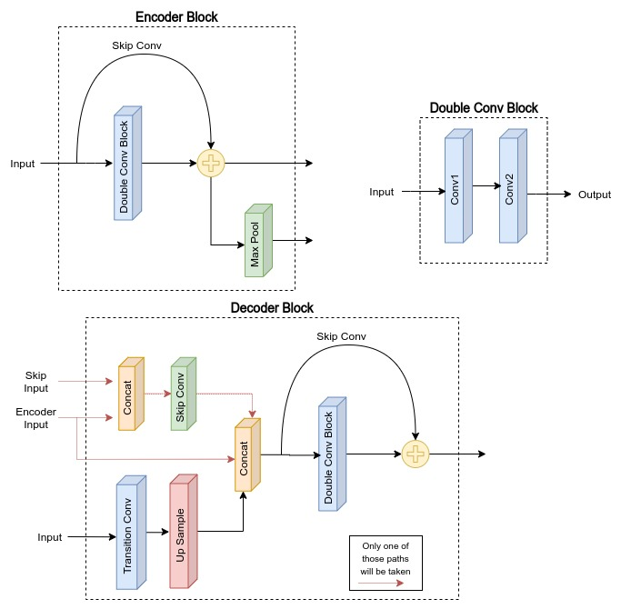

# Model Architecture

The inputs and the outputs are of same resolution and thus the model has an encoder-decoder architecture, where the model takes two inputs: BG and BG-FG and returns two outputs: Depth Map and Mask. The inputs are first individually processed through two encoder blocks each, which in turn reduces their size to 56x56, given the input shapes are 224x224. The reason for processing the two inputs separately for two encoder blocks is that:

- The output of these encoder blocks will be later fed as a skip connection to the last layers of the model, this might help the model in making better predictions as this way, the model will have the chance to see the two inputs separately in its last layers which may enhance its performance to identify the differences between the two inputs which is required to predict the mask and depth of the foreground object.
- An image of size 56x56 is sufficient for a convolutional model to extract information out of it. Thus we can apply two encoder blocks on the images separately before sending them to the network and not worry about losing information.

After encoding the inputs, they are merged together and sent through a series of encoder blocks until the image size becomes 7x7x512 (again a reminder, all these calculations are based on the fact that the input given to the model is 224x224).

After the encoding has been done, the encoded input is passed through two separate decoder networks which are responsible for predicting the depth map and the mask respectively. This encoder-decoder architecture is based on the famous convolutional neural network _UNet_.
The model architecutre can be seen below



The model has `10,343,490` parameters. Each of the encoder and decoder blocks are based on a ResNet block. The detailed diagram explaining the flow of each block can be seen below



The code for the full architecture can be found [here](../tensornet/model/dsresnet.py)

## Model Summary

```
----------------------------------------------------------------
        Layer (type)               Output Shape         Param #
================================================================
            Conv2d-1         [-1, 16, 224, 224]              64
            Conv2d-2         [-1, 16, 224, 224]             448
              ReLU-3         [-1, 16, 224, 224]               0
       BatchNorm2d-4         [-1, 16, 224, 224]              32
            Conv2d-5         [-1, 16, 224, 224]           2,320
              ReLU-6         [-1, 16, 224, 224]               0
       BatchNorm2d-7         [-1, 16, 224, 224]              32
   DoubleConvBlock-8         [-1, 16, 224, 224]               0
         MaxPool2d-9         [-1, 16, 112, 112]               0
  ResEncoderBlock-10  [[-1, 16, 112, 112], [-1, 16, 224, 224]] 0
           Conv2d-11         [-1, 32, 112, 112]             544
           Conv2d-12         [-1, 32, 112, 112]           4,640
             ReLU-13         [-1, 32, 112, 112]               0
      BatchNorm2d-14         [-1, 32, 112, 112]              64
           Conv2d-15         [-1, 32, 112, 112]           9,248
             ReLU-16         [-1, 32, 112, 112]               0
      BatchNorm2d-17         [-1, 32, 112, 112]              64
  DoubleConvBlock-18         [-1, 32, 112, 112]               0
        MaxPool2d-19           [-1, 32, 56, 56]               0
  ResEncoderBlock-20  [[-1, 32, 56, 56], [-1, 32, 112, 112]]  0
           Conv2d-21         [-1, 16, 224, 224]              64
           Conv2d-22         [-1, 16, 224, 224]             448
             ReLU-23         [-1, 16, 224, 224]               0
      BatchNorm2d-24         [-1, 16, 224, 224]              32
           Conv2d-25         [-1, 16, 224, 224]           2,320
             ReLU-26         [-1, 16, 224, 224]               0
      BatchNorm2d-27         [-1, 16, 224, 224]              32
  DoubleConvBlock-28         [-1, 16, 224, 224]               0
        MaxPool2d-29         [-1, 16, 112, 112]               0
  ResEncoderBlock-30  [[-1, 16, 112, 112], [-1, 16, 224, 224]] 0
           Conv2d-31         [-1, 32, 112, 112]             544
           Conv2d-32         [-1, 32, 112, 112]           4,640
             ReLU-33         [-1, 32, 112, 112]               0
      BatchNorm2d-34         [-1, 32, 112, 112]              64
           Conv2d-35         [-1, 32, 112, 112]           9,248
             ReLU-36         [-1, 32, 112, 112]               0
      BatchNorm2d-37         [-1, 32, 112, 112]              64
  DoubleConvBlock-38         [-1, 32, 112, 112]               0
        MaxPool2d-39           [-1, 32, 56, 56]               0
  ResEncoderBlock-40  [[-1, 32, 56, 56], [-1, 32, 112, 112]]  0
           Conv2d-41           [-1, 32, 56, 56]           2,080
           Conv2d-42           [-1, 64, 56, 56]           2,112
           Conv2d-43           [-1, 64, 56, 56]          18,496
             ReLU-44           [-1, 64, 56, 56]               0
      BatchNorm2d-45           [-1, 64, 56, 56]             128
           Conv2d-46           [-1, 64, 56, 56]          36,928
             ReLU-47           [-1, 64, 56, 56]               0
      BatchNorm2d-48           [-1, 64, 56, 56]             128
  DoubleConvBlock-49           [-1, 64, 56, 56]               0
        MaxPool2d-50           [-1, 64, 28, 28]               0
  ResEncoderBlock-51  [[-1, 64, 28, 28], [-1, 64, 56, 56]]    0
           Conv2d-52          [-1, 128, 28, 28]           8,320
           Conv2d-53          [-1, 128, 28, 28]          73,856
             ReLU-54          [-1, 128, 28, 28]               0
      BatchNorm2d-55          [-1, 128, 28, 28]             256
           Conv2d-56          [-1, 128, 28, 28]         147,584
             ReLU-57          [-1, 128, 28, 28]               0
      BatchNorm2d-58          [-1, 128, 28, 28]             256
  DoubleConvBlock-59          [-1, 128, 28, 28]               0
        MaxPool2d-60          [-1, 128, 14, 14]               0
  ResEncoderBlock-61  [[-1, 128, 14, 14], [-1, 128, 28, 28]]  0
           Conv2d-62          [-1, 256, 14, 14]          33,024
           Conv2d-63          [-1, 256, 14, 14]         295,168
             ReLU-64          [-1, 256, 14, 14]               0
      BatchNorm2d-65          [-1, 256, 14, 14]             512
           Conv2d-66          [-1, 256, 14, 14]         590,080
             ReLU-67          [-1, 256, 14, 14]               0
      BatchNorm2d-68          [-1, 256, 14, 14]             512
  DoubleConvBlock-69          [-1, 256, 14, 14]               0
        MaxPool2d-70            [-1, 256, 7, 7]               0
  ResEncoderBlock-71  [[-1, 256, 7, 7], [-1, 256, 14, 14]]    0
           Conv2d-72            [-1, 512, 7, 7]         131,584
           Conv2d-73            [-1, 512, 7, 7]       1,180,160
             ReLU-74            [-1, 512, 7, 7]               0
      BatchNorm2d-75            [-1, 512, 7, 7]           1,024
           Conv2d-76            [-1, 512, 7, 7]       2,359,808
             ReLU-77            [-1, 512, 7, 7]               0
      BatchNorm2d-78            [-1, 512, 7, 7]           1,024
  DoubleConvBlock-79            [-1, 512, 7, 7]               0
        MaxPool2d-80            [-1, 512, 3, 3]               0
  ResEncoderBlock-81  [[-1, 512, 3, 3], [-1, 512, 7, 7]]      0
           Conv2d-82            [-1, 256, 7, 7]         131,328
           Conv2d-83          [-1, 256, 14, 14]         131,328
           Conv2d-84          [-1, 256, 14, 14]       1,179,904
             ReLU-85          [-1, 256, 14, 14]               0
      BatchNorm2d-86          [-1, 256, 14, 14]             512
           Conv2d-87          [-1, 256, 14, 14]         590,080
             ReLU-88          [-1, 256, 14, 14]               0
      BatchNorm2d-89          [-1, 256, 14, 14]             512
  DoubleConvBlock-90          [-1, 256, 14, 14]               0
  ResDecoderBlock-91          [-1, 256, 14, 14]               0
           Conv2d-92          [-1, 128, 14, 14]          32,896
           Conv2d-93          [-1, 128, 28, 28]          32,896
           Conv2d-94          [-1, 128, 28, 28]         295,040
             ReLU-95          [-1, 128, 28, 28]               0
      BatchNorm2d-96          [-1, 128, 28, 28]             256
           Conv2d-97          [-1, 128, 28, 28]         147,584
             ReLU-98          [-1, 128, 28, 28]               0
      BatchNorm2d-99          [-1, 128, 28, 28]             256
 DoubleConvBlock-100          [-1, 128, 28, 28]               0
 ResDecoderBlock-101          [-1, 128, 28, 28]               0
          Conv2d-102           [-1, 64, 28, 28]           8,256
          Conv2d-103           [-1, 64, 56, 56]           8,256
          Conv2d-104           [-1, 64, 56, 56]          73,792
            ReLU-105           [-1, 64, 56, 56]               0
     BatchNorm2d-106           [-1, 64, 56, 56]             128
          Conv2d-107           [-1, 64, 56, 56]          36,928
            ReLU-108           [-1, 64, 56, 56]               0
     BatchNorm2d-109           [-1, 64, 56, 56]             128
 DoubleConvBlock-110           [-1, 64, 56, 56]               0
 ResDecoderBlock-111           [-1, 64, 56, 56]               0
          Conv2d-112           [-1, 32, 56, 56]           2,080
          Conv2d-113         [-1, 32, 112, 112]           2,080
          Conv2d-114         [-1, 32, 112, 112]           2,080
          Conv2d-115         [-1, 32, 112, 112]          18,464
            ReLU-116         [-1, 32, 112, 112]               0
     BatchNorm2d-117         [-1, 32, 112, 112]              64
          Conv2d-118         [-1, 32, 112, 112]           9,248
            ReLU-119         [-1, 32, 112, 112]               0
     BatchNorm2d-120         [-1, 32, 112, 112]              64
 DoubleConvBlock-121         [-1, 32, 112, 112]               0
 ResDecoderBlock-122         [-1, 32, 112, 112]               0
          Conv2d-123         [-1, 16, 112, 112]             528
          Conv2d-124         [-1, 16, 224, 224]             528
          Conv2d-125         [-1, 16, 224, 224]             528
          Conv2d-126         [-1, 16, 224, 224]           4,624
            ReLU-127         [-1, 16, 224, 224]               0
     BatchNorm2d-128         [-1, 16, 224, 224]              32
          Conv2d-129         [-1, 16, 224, 224]           2,320
            ReLU-130         [-1, 16, 224, 224]               0
     BatchNorm2d-131         [-1, 16, 224, 224]              32
 DoubleConvBlock-132         [-1, 16, 224, 224]               0
 ResDecoderBlock-133         [-1, 16, 224, 224]               0
          Conv2d-134          [-1, 1, 224, 224]              17
          Conv2d-135            [-1, 256, 7, 7]         131,328
          Conv2d-136          [-1, 256, 14, 14]         131,328
          Conv2d-137          [-1, 256, 14, 14]       1,179,904
            ReLU-138          [-1, 256, 14, 14]               0
     BatchNorm2d-139          [-1, 256, 14, 14]             512
          Conv2d-140          [-1, 256, 14, 14]         590,080
            ReLU-141          [-1, 256, 14, 14]               0
     BatchNorm2d-142          [-1, 256, 14, 14]             512
 DoubleConvBlock-143          [-1, 256, 14, 14]               0
 ResDecoderBlock-144          [-1, 256, 14, 14]               0
          Conv2d-145          [-1, 128, 14, 14]          32,896
          Conv2d-146          [-1, 128, 28, 28]          32,896
          Conv2d-147          [-1, 128, 28, 28]         295,040
            ReLU-148          [-1, 128, 28, 28]               0
     BatchNorm2d-149          [-1, 128, 28, 28]             256
          Conv2d-150          [-1, 128, 28, 28]         147,584
            ReLU-151          [-1, 128, 28, 28]               0
     BatchNorm2d-152          [-1, 128, 28, 28]             256
 DoubleConvBlock-153          [-1, 128, 28, 28]               0
 ResDecoderBlock-154          [-1, 128, 28, 28]               0
          Conv2d-155           [-1, 64, 28, 28]           8,256
          Conv2d-156           [-1, 64, 56, 56]           8,256
          Conv2d-157           [-1, 64, 56, 56]          73,792
            ReLU-158           [-1, 64, 56, 56]               0
     BatchNorm2d-159           [-1, 64, 56, 56]             128
          Conv2d-160           [-1, 64, 56, 56]          36,928
            ReLU-161           [-1, 64, 56, 56]               0
     BatchNorm2d-162           [-1, 64, 56, 56]             128
 DoubleConvBlock-163           [-1, 64, 56, 56]               0
 ResDecoderBlock-164           [-1, 64, 56, 56]               0
          Conv2d-165           [-1, 32, 56, 56]           2,080
          Conv2d-166         [-1, 32, 112, 112]           2,080
          Conv2d-167         [-1, 32, 112, 112]           2,080
          Conv2d-168         [-1, 32, 112, 112]          18,464
            ReLU-169         [-1, 32, 112, 112]               0
     BatchNorm2d-170         [-1, 32, 112, 112]              64
          Conv2d-171         [-1, 32, 112, 112]           9,248
            ReLU-172         [-1, 32, 112, 112]               0
     BatchNorm2d-173         [-1, 32, 112, 112]              64
 DoubleConvBlock-174         [-1, 32, 112, 112]               0
 ResDecoderBlock-175         [-1, 32, 112, 112]               0
          Conv2d-176         [-1, 16, 112, 112]             528
          Conv2d-177         [-1, 16, 224, 224]             528
          Conv2d-178         [-1, 16, 224, 224]             528
          Conv2d-179         [-1, 16, 224, 224]           4,624
            ReLU-180         [-1, 16, 224, 224]               0
     BatchNorm2d-181         [-1, 16, 224, 224]              32
          Conv2d-182         [-1, 16, 224, 224]           2,320
            ReLU-183         [-1, 16, 224, 224]               0
     BatchNorm2d-184         [-1, 16, 224, 224]              32
 DoubleConvBlock-185         [-1, 16, 224, 224]               0
 ResDecoderBlock-186         [-1, 16, 224, 224]               0
          Conv2d-187          [-1, 1, 224, 224]              17
        DSResNet-188  [[-1, 1, 224, 224], [-1, 1, 224, 224]]  0
================================================================
Total params: 10,343,490
Trainable params: 10,343,490
Non-trainable params: 0
----------------------------------------------------------------
Input size (MB): 86436.00
Forward/backward pass size (MB): 3193797.28
Params size (MB): 39.46
Estimated Total Size (MB): 3280272.75
----------------------------------------------------------------
```
