# Deciding Loss Function

## Mask Prediction

[](https://colab.research.google.com/drive/1eJTCyUxPvlBHsZRK9EZgwaBrBi19Yirj?usp=sharing)

The first step in building a model was to try out predicting just the masks. The masks had only two values, 0 or 255 so I figured a relatively small model should give great results. So I tried a model with a mere `59,745` parameters and a randomly chosen `BCEWithLogitsLoss` loss function and results were great. Even after the first epoch itself, the model was able to mask the foreground objects from the input images correctly. The code for the model architecture can be found [here](../tensornet/model/masknet.py) and the model summary can found in the colab link given above.

### Model Summary

 ```
 ----------------------------------------------------------------
        Layer (type)               Output Shape         Param #
================================================================
            Conv2d-1         [-1, 32, 224, 224]             896
              ReLU-2         [-1, 32, 224, 224]               0
       BatchNorm2d-3         [-1, 32, 224, 224]              64
           Dropout-4         [-1, 32, 224, 224]               0
            Conv2d-5         [-1, 32, 224, 224]             896
              ReLU-6         [-1, 32, 224, 224]               0
       BatchNorm2d-7         [-1, 32, 224, 224]              64
           Dropout-8         [-1, 32, 224, 224]               0
            Conv2d-9         [-1, 32, 224, 224]           2,080
           Conv2d-10         [-1, 64, 224, 224]          18,496
             ReLU-11         [-1, 64, 224, 224]               0
      BatchNorm2d-12         [-1, 64, 224, 224]             128
          Dropout-13         [-1, 64, 224, 224]               0
           Conv2d-14         [-1, 64, 224, 224]          36,928
             ReLU-15         [-1, 64, 224, 224]               0
      BatchNorm2d-16         [-1, 64, 224, 224]             128
          Dropout-17         [-1, 64, 224, 224]               0
           Conv2d-18          [-1, 1, 224, 224]              65
          MaskNet-19          [-1, 1, 224, 224]               0
================================================================
Total params: 59,745
Trainable params: 59,745
Non-trainable params: 0
----------------------------------------------------------------
Input size (MB): 86436.00
Forward/backward pass size (MB): 307.02
Params size (MB): 0.23
Estimated Total Size (MB): 86743.24
----------------------------------------------------------------
 ```

Now for the initial attempt, I chose the loss function randomly but for building a proper model I need to know which is the best loss function for this task. After reading a lot of research papers and online blogs, I shortlisted three loss functions for testing

### Binary Crossentropy (BCE) Loss

- BCE loss is used for binary classification tasks.
- Since the output images are grayscale, BCE loss seemps appropriate for this task.
- We use the PyTorch's `nn.BCEWithLogitsLoss` implementation of BCE loss as it applies the sigmoid function to the output automatically.

#### Predictions

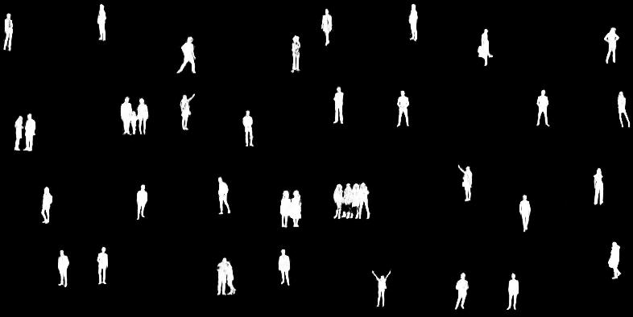

### The Structural Similarity Index (SSIM) Loss

- SSIM loss will look for similarities within pixels; i.e. if the pixels in the two images line up and or have similar pixel density values.
- **Standardized Values**: SSIM puts everything in a scale of -1 to 1. A score of 1 meant they are very similar and a score of -1 meant they are very different.

#### Predictions


### Dice Loss

Dice loss seems to perform well in image segmentation tasks as it considers not only the global distribution of information in the image but also the local distribution of information as well. For calculating dice loss, we need to calculate the _dice coefficient_ first.

#### Dice Coefficient

Dice coefficient is an evaluation metric that can be used to evaluate image reconstruction models. This metric considers _how similar_ the objects are as well as _where_ are they placed in the image.

`dice_loss = 1 - dice_coefficient`

#### Predictions

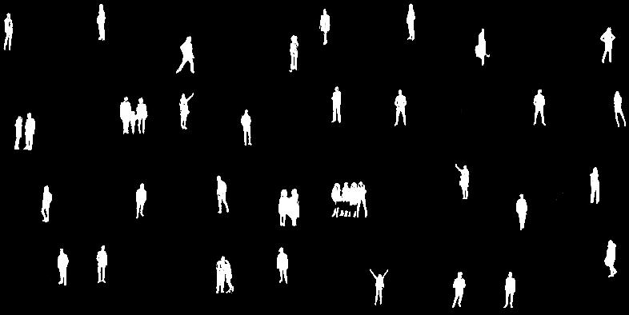

After training the model with the three loss functions, I decided to use Intersection over Union (IoU) as the evaluation metric and got the following results

|             Validation Loss             |                  IoU                  |
| :-------------------------------------: | :-----------------------------------: |
| 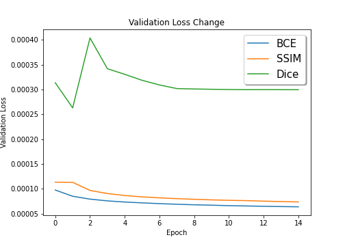 | 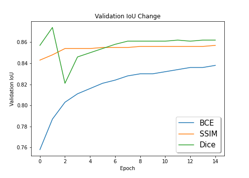 |

As from the results above, we can see that the **Dice Loss** and **SSIM Loss** outperform BCE Loss.

The code for this test can be found in the Google Colab link mentioned above as well as [here](../trial_notebooks/Mask_Prediction_Loss_Comparison.ipynb). The code for dice loss and ssim loss can found inside the files `dice.py` and `ssim.py` respectively [here](../tensornet/model/loss/).

## Depth and Segmentation Prediction

[](https://colab.research.google.com/drive/19PoQ_KbcpHM-9pCTMoqby0Pr1--aCYpS?usp=sharing)

After predicting mask images and getting a cursory idea on what loss functions to use, the next task is to decide the loss function for the entire problem i.e. predicting both depth estimations and segmentations. From the mask prediction exercise, we found that the **Dice Loss** and **SSIM Loss** work the best but even **BCE Loss** gives pretty good results. And after reading quite a lot of research papers on the related domain and observing what metrics are generally used by others, I shortlisted two loss functions for depth predictions: Root Mean Square Error (**RMSE**) and **SSIM Loss**.

So now for the problem, I have 4 loss functions to choose from. So instead of taking any two (one for depth and other for mask), I decided to go for a combination of two or more loss functions. These combinations were based on various online blogs and papers I found online while studying for the problem. I shorlisted these three combinations

### RMSE + (BCE & Dice)

- RMSE is calculated on the depth prediction
- BCE and Dice are calculated on the mask prediction
- Total loss = `2 * rmse(depth) + (bce(mask) + 2 * dice(mask))`

#### Predictions

|             Depth Estimation             |            Segmentation Mask            |
| :--------------------------------------: | :-------------------------------------: |
| 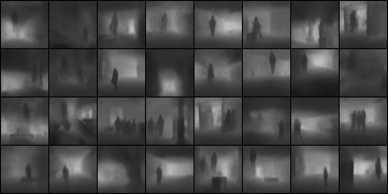 | 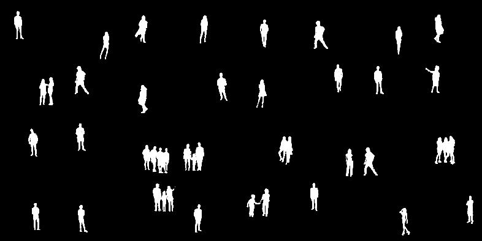 |

### SSIM + Dice

- SSIM is calculated on the depth prediction
- Dice is calculated on the mask prediction
- Total loss = `2 * ssim(depth) + dice(mask)`

#### Predictions

|           Depth Estimation           |          Segmentation Mask          |
| :----------------------------------: | :---------------------------------: |
| 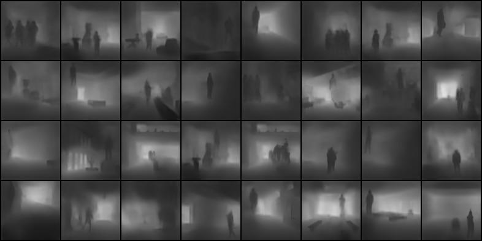 | 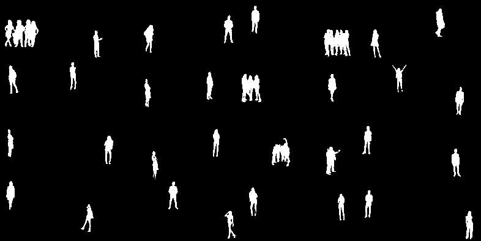 |

### RMSE + BCE

- RMSE is calculated on the depth prediction
- BCE is calculated on the mask prediction
- Total loss = `2 * rmse(depth) + bce(mask)`

#### Predictions

|          Depth Estimation           |         Segmentation Mask          |
| :---------------------------------: | :--------------------------------: |
| 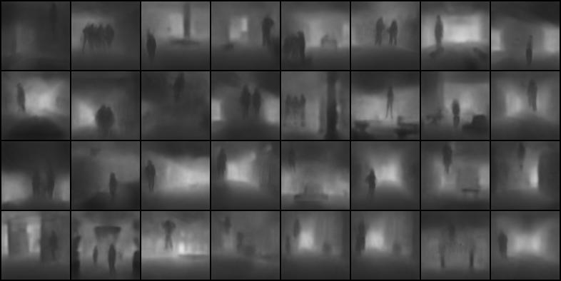 | 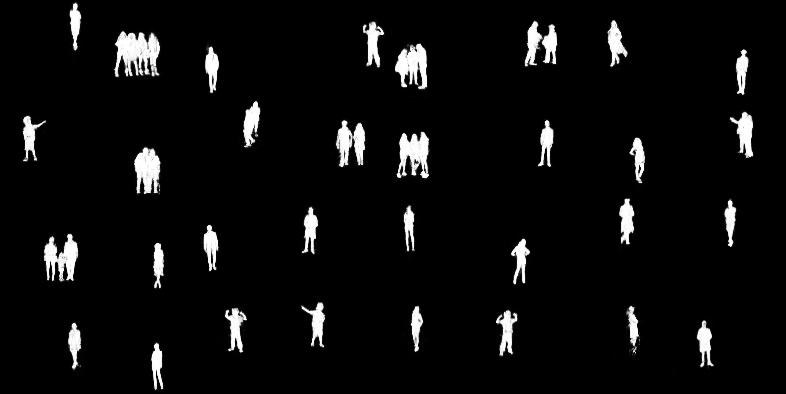 |

The code for all these loss functions can be found [here](../loss.py). IoU and RMSE were used to evaluate these loss functions

|             Validation Loss              |                  IoU                   |                   RMSE                   |
| :--------------------------------------: | :------------------------------------: | :--------------------------------------: |
| 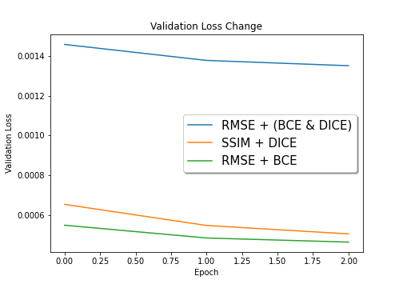 | 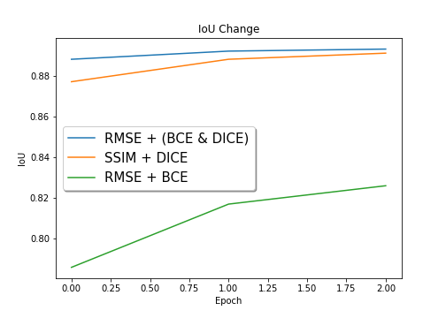 | 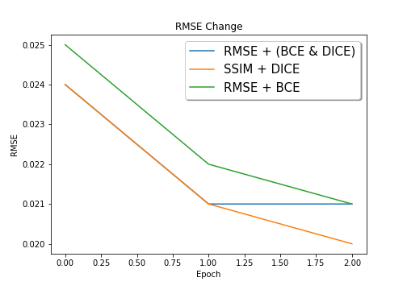 |

As seen from the observations above, we can say that **RMSE + (BCE & Dice)** and **SSIM + Dice** are the best performers. The code for this test can be found in the Google Colab link mentioned above as well as [here](../trial_notebooks/Depth_Prediction_Loss_Comparison.ipynb).
