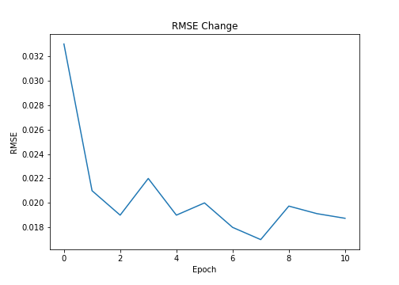
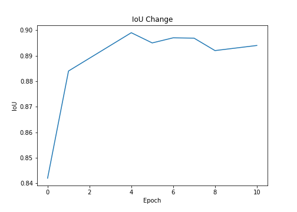
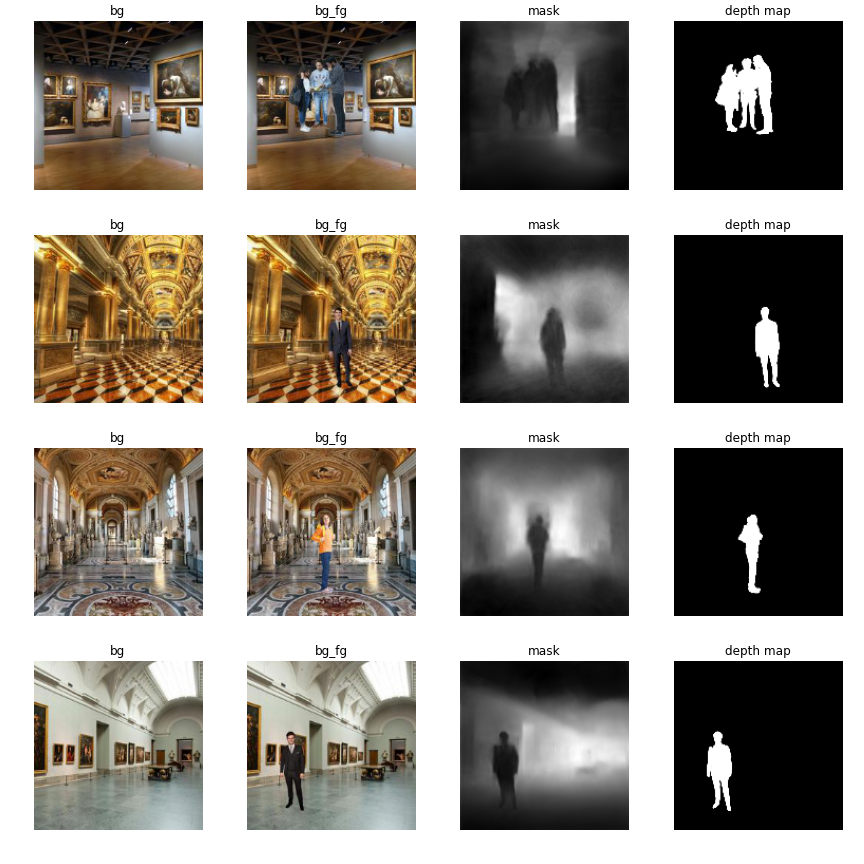
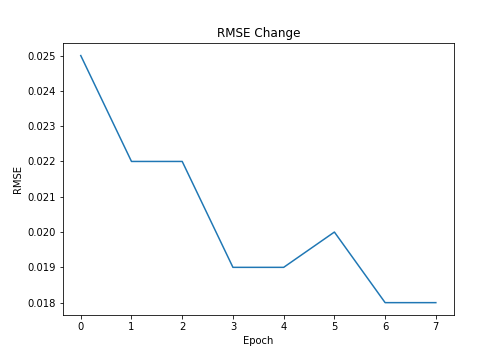
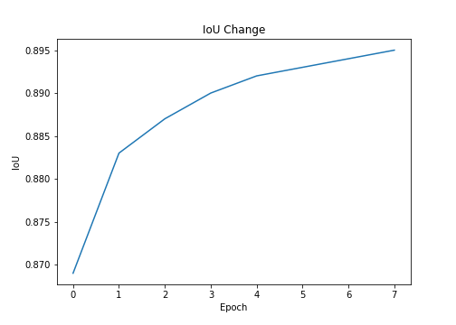
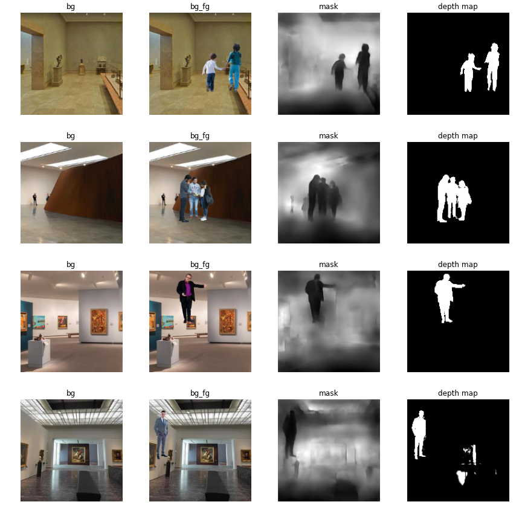
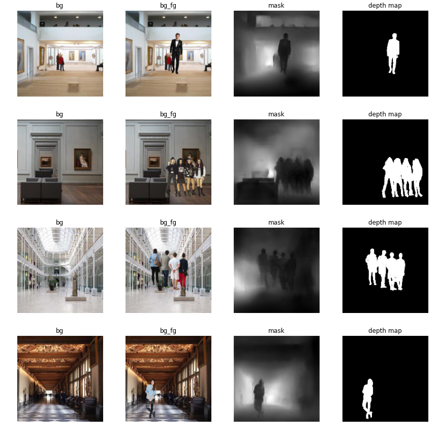

# Training

After finalizing the model architecture, dataset and loss functions, we can now start training the model. In [this](deciding_loss_function.md#depth-and-segmentation-prediction) section, we selected two loss functions: **RMSE + (BCE & Dice)** and **SSIM + Dice**. So, we'll train our model with those two loss functions.

Each experiment described below had the following common traits

- The model was trained on smaller resolution images first and then gradually the image resolution was increased.
- **IoU** and **RMSE** were used as evaluation metrics. IoU was calculated on mask outputs while rmse was calculated on depth outputs.
- TensorBoard integration which generated model output after every epoch to keep track of model progress.
- Reduce LR on Plateau with patience of 2 and min lr of 1e-6.
- Auto model checkpointing which saved the model weights after every epoch.
- Each model was trained in small sets of epochs, this was done to ensure that the model training does not suffer from sudden disconnection from Google Colab.

The code used for training the model can be found [here](tensornet/engine/learner.py). The `Learner` class present in this file was inherited by the file [here](learner.py) to adapt for the changes in the depth-segmentation model.

## RMSE + (BCE & Dice)

This experiment had the following features:

- Data Augmentation
  - Hue Saturation Value
  - Random Contrast
- Image resolution change during training
  - First 3 epochs: 96x96
  - Epoch 4-8: 160x160
  - Epoch 9-11: 224x224

The code for the experiment can be found in the Google Colab link mentioned above as well as [here](../trial_notebooks/DES_RMSE_BCE_Dice.ipynb).

### Results

|                       RMSE                       |                      IoU                       |
| :----------------------------------------------: | :--------------------------------------------: |
|  |  |

### Predictions

## SSIM + Dice

This experiment had the following features:

- Data Augmentation
  - Hue Saturation Value
  - Random Contrast
- Image resolution change during training
  - First 3 epochs: 96x96
  - Epoch 4-8: 160x160

The code for the experiment can be found in the Google Colab link mentioned above as well as [here](../trial_notebooks/DES_SSIM_DICE.ipynb).

### Results

|                     RMSE                     |                    IoU                     |
| :------------------------------------------: | :----------------------------------------: |
|  |  |

### Predictions

## LR Range Test

Neither of the experiments above gave very good results, so I thought of performing the LR Range Test in order to find the best initial learning rate for the model and then train the model again. The LR Range test was perfomed 5 times and I got the following results

| Start LR | End LR | Iterations |  Loss  | Learning Rate |
| :------: | :----: | :--------: | :----: | :-----------: |
|   1e-7   |   5    |    400     | 0.3917 |    0.2805     |
|   1e-5   |   1    |    400     | 0.2976 |    0.1090     |
|   1e-4   |   10   |    200     | 0.3653 |    0.4467     |
|   1e-5   |   2    |    100     | 0.8588 |    0.2511     |
|   1e-7   |   10   |    400     | 0.3179 |    0.2884     |

The least loss was obtained when learning rate was ~ `0.1`. I choose the initial learning rate 0.1 for my next experiment. The code for the experiment can be found in the Google Colab link mentioned above as well as [here](../trial_notebooks/LR_Range_Test_DSResNet.ipynb).

## RMSE + (BCE & Dice) with New LR and No Augmentation

This experiment had the following features:

- Initial Learning Rate: 0.1
- Learning Rate is manually reduced by 10 after 3 epochs.
- Image resolution change during training
  - First 3 epochs: 96x96
  - Epoch 4-6: 160x160
- This models reaches an IoU for 0.92 and RMSE of 0.014 which makes it the best of the models tested above.

The code for the experiment can be found in the Google Colab link mentioned above as well as [here](../Depth_Estimation_Segmentation_ResNet.ipynb).

### Results

|                  RMSE                  |                 IoU                  |
| :------------------------------------: | :----------------------------------: |
|  |  |

### Predictions

So from the predictions, we can say that the **RMSE + (BCE & Dice)** Loss without any augmentation and a proper initial LR seems to be the best loss function suitable for this task.
